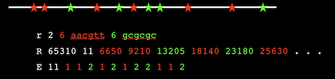
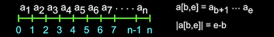
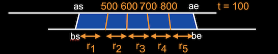
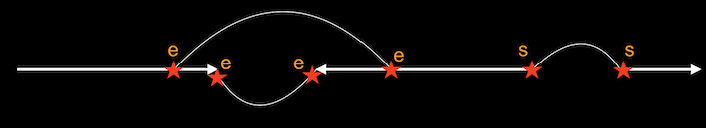

# VGP Tools: The VGP tool kit and formats

### Authors:  Gene Myers, Richard Durbin, and the Vertebrate Genome Project Assembly Group
### Date: February 18-22, 2019
### Last Update: February 5, 2020

<br>
<br>

# 0. Introduction

VGP-Tools is a growing collection of tools designed to operate on all the forms of data involved
in a DNA sequencing and assembly project.   The specification of the content of the several types of data files involved has a very simple ASCII format that is easy for both humans and programs to read and interpret.  Moreover, there is a corresponding compressed and indexed binary representation for each ASCII datum so that production VGP tools are very efficient in time and the size of the data files they manipulate.  A simple converter allows one to move between the ASCII and binary representations of data.

The framework allows one to represent source data, process intermediates, and the ultimate reconstructed genome assemblies for a large-scale DNA sequencing project.
There are six **primary file types**, one for each of *sequences*, *restriction maps*,
*alignments*, *links*, *breaks*, and *lists*, that contain a collection of objects of a given type.  Each
of these primary file types can be specialized as a **secondary file type** that ensures certain
semantic constraints on the objects (e.g. all reads are paired and have QVs), and/or introduces
additional information about each object (e.g. pulse widths for PacBio read sequences.)

The list below gives an overview of the currently supported VGP file types where the secondary types
are listed indented below each primary.  By convention every primary and secondary file type is 
assigned a 3-letter lower case string, that can be used as a filename suffix, e.g. dataset1.seq
or dataset2.pbr.

- **.seq**   primary file type for sequence objects.
	- **.irp** for Illumina read pairs.
	- **.pbr** for PacBio long reads and relevant meta-data.
	- **.10x** for 10X Genomics read clouds with their extracted barcodes.
	- **.ctg** for contigs from an assembly.
	- **.kmr** for sets of kmers.

- **.rmp**   primary type for restriction map (RM) objects.
	- **.rmm** for RMs for individual molecules produced by e.g. Bionano.
	- **.rms** for RMs produced *in slico* from sequence.
	- **.rma** for RMs produced by assembly of molecule RMs.

- **.aln**   primary type for alignments between sequences and restriction maps.
	- **.sxs** for alignments between sequences (pronounced "success").
	- **.rxr** for alignments between restriction maps.
	- **.sxr** for alignments between sequences and restriction maps .
	- **.map** for alignments between sequences and a target superstring.
	
- **.hit**   primary type for incidence data of kmers in sequences and vice versa.
	- **.k2s** for lists per kmer of the sequences it hits.
	- **.s2k** for lists per sequence of the kmers that hit it.

- **.jns**   primary type for join information between (contig) sequences.

- **.brk**   primary type for break or mis-join information within (contig) sequences.

- **.lis**   a utility file type recording lists of objects of any of the other types.
	- **.lyo** lists of sequence alignments defining an assembly layout.
	- **.scf** lists of scaffolding links defining sets of linear scaffolds.

Every VGP file begins with a header segment followed by a data segment.  Headers, relevant for all
file types, are described in Chapter 1 following this introduction, and the encoding of the data
in each file type is documented in a sub-chapter of Chapter 2.
The formal definition of all currently valid file types is effectively defined by the code for
the utility program **vgpvalidate** which validates the format of any given file, and which also
can optionally reconstruct a file's header segment given only the data part.

The design of VGP formats is based on the following principles:

1.	The format should be trivial to parse as input.  All the burden of encoding is placed
on the software that produces the formatted file.

2.	The length of a list should always precede the list (e.g. 3 xxx).  Bracket (.eg [xxx]) or
terminator (e.g. xxx0) constructions are not permitted.

3.	The number of items, and the maximum size or total size of variable-length items to follow
should be specified at the start of a file so that any desired memory allocation can be performed
once at the start by the reader.

4.	For every format file type, there should be a VGP tool that translates the ASCII format
to a terse, indexable binary form and another that inverts this conversion, as well as a
code-level interface to the binary encoding.

5.	The ASCII form should not be overly verbose, it is not for human consumption, but simply
must be easily interpretable by a human being when and if they need to look at the data.

6.	Complex identifiers or symbolic names for objects are not used.  The nth occurrence of an
object of a given type is referred to by the number n in any future context within the file.

7.	A reference to an object is not permitted before its definition.

8.	The provenance of a file must be given as the sequence of tools applied to obtain it,
where each tool application is described by its name, version number, command line applied,
and date & time performed. 

Syntactically, an ASCII VGP file should be readable by a simple parser that can
(a) read the next integer, (b) read the next real number, (c) read the next n symbols, and
(d) skip to the next line, where each item can begin with single white space character.
Moreover, any program reading in VGP data should never require dynamic memory
allocation to store objects – the size of any object or object collection should be given
before the first object of that type is described.  We realized this by designing VGP formats
so that every file begins with a header section that gives the number of objects, maximum size
of an object, and total size of all objects, along with the provenance information of Principle 8.

Following Principle 5, VGP formats uses a very simple “1-code” schema in which the data is
encoded in an ASCII file in a sequence of lines where the first character of each line determines
what kind of information the line encodes.  Consider as an example, the following Illumina read
pair (.irp) file:

```
     1 3 seq 1 0            header start: primary file type, major and minor version
     2 3 irp                optional secondary subtype
     ! 7 VGPpair 3 0.1 ...  provenance line saying how file arose
     # P 3                  number of read pairs in file
     # S 6                  number of sequences in file
     @ S 5                  maximum number of bp’s in a read
     + S 26                 total number of bp's in file

     P                      data start: separator for read pairs - helps human interpretability 
     S 5 acgta              forward sequence of pair 1
     S 3 gtt                reverse sequence of pair 1
     P                      pair 2
     S 4 gcta               sequence 3
     S 5 ggtac              sequence 4
     P                      pair 3
     S 4 atta               sequence 5
     S 5 cctac              sequence 6
```
Like all VGP files, the example starts with a set of header lines indicated by *non-alphabetic*
"1-code" symbols, followed by data lines that always begin with *alphabetic* "1-codes".  Tokens on
a line are separated by a single whitespace character (space or tab).  Variable length lists,
including strings, are preceded by their length in keeping with Principle 2.  Thus, the 1-code and
subsequent tokens determine when the encoding of information on a line is at an end. 
Therefore optional additional information to the end of the line, for example the comments in
the example above, provides an extensibility
mechanism where one can add auxiliary information if desired.

The first header line must always be a 1-line confirming the primary file type and specifying
the major and minor version numbers separated by whitespace.
This can optionally be followed immediately by a file subtype line of type ```2``` that gives the
secondary file type.
Additional header lines give information about the number of items
in the file (#-lines), the maximum length of lists (@-lines), and the total number of items in
a given list class (+-lines).  Finally, provenance lines (!-lines) inform one about how the
particular file came to be.  The data segment in this simple example then consists of pairs
of reads encoded by P-lines indicating the beginning of a pair, followed by two S-lines
giving the two sequence reads in the pair.

Conceptually VGP files are *immutable*, meaning that we do not expect their contents to change.
This means that subsequently in the same file, or more often in future files in a pipeline, we
can refer to objects by their ordinal position in a file, 1...n, not requiring named identifiers
(Principle 6).  This simplifies many things.

<br>
<br>

# 1. File Headers

Considerable effort is invested on headers in VGP-formats in keeping with Principles 3 and 8.
We will specify VGP format syntax with "casual" context-free grammar rules.
Tokens are between angle-braces ```<>``` and may optionally have a descriptive tag following
a colon after the token name, e.g. ```<string:file_name>```.  The token name can be a predefined
type, such as ```int```, ```real```, or ```char```, in which case the syntax of the token is
the usual lexical syntax for such literals.  The right hand side of a rule can also be a
regular expression, where ```*``` denotes 0-or-more, ```+``` 1-or-more, ```^n``` exactly n
repetitions, ```|``` separates two alternatives, an item between square brackets ```[]``` is
optional, and parentheses may be used to disambiguate precedence.  For example, a string
is defined by the rule:
```
    <string> = <int:n> <char>^n
```

The first line of any header must be the primary file type declaration that has
the synatx:

```
    <version_header> = 1 <string:file_type> <int:major> <int:minor>
```
where the initial ```1``` indicates that this is a "1-code" file (as well as this being line 1
&#x1F609;)
and ```<file_type>``` is one of the five 3-letter file suffixes given at the start.

The initial header line can be followed by an optional subtype line

```
    <subtype_header> = 2 <string:file_subtype>
```
where now file type is one of the suffixes above for a secondary file type.

Next there are three header line types - #, +, and @ - that allow one to specify the number, total size, and maximum size of objects across a file.  These all have the syntax:

```
    <size_header> = [#+@] <symbol:S> <int>
```
\#-lines tell you the number of lines in the file of type S.  For line types that encode a
list of items, such as ```<string>``` (a list of characters) or say a list of restriction map
sites, a +-line tells you the total number of items in all the lists in the file,
e.g. "<code>+ S 26</code>" in the example above indicates that altogether the sequences in the
file total 26 bases.  Similarly, an @-line indicates the length of the largest list that
occurs in any given line of the specified type.
These "limit" lines are only present for line types that occur in the body and not lines
that occur in the header itself.  In almost all cases there is only one list object
per line type, however, a notable exception is the restriction site line (see 2.2), which has
a variable number of strings in a line.  In such cases, ```+``` is the sum of all of the list
element lengths over all lines of the given type, and <code>@</code> is the maximum of the sum of the
list lengths of each line.

Often the objects in a file are naturally partitioned into groups, e.g. all the read pairs in a
flow-cell lane, or all the read pairs in a "cloud".   VGP formats support this with the concept
of "group" data lines that by convention have lower case symbols as the line type indicator.
For a group, one would like to know the maximum number of items of a given type in any group
and the maximum size needed to contain all the list objects occurring in any group.  So in the
header, a ```%``` designator indicates the maximum number of objects or maximum total size of
list objects within any given group type.  The syntax for these lines is:  

```
    <group_header> = % <symbol:g> [#+] <symbol:S> <int>
```
where ```g``` is the group line designator and ```S``` is the line type in question.
(The ```@``` reduction is not necessary as it is the same as the global maximum.)

Another important header line type indicates that references in this file are made to objects
in another file. This has the syntax:

```
    <reference_header> = < <string:file_name> <int:nx>
```
All the objects (all of the same type) in the specified file are available and
and ```nx``` indicates the number of these items in the file (hence
the range of reference indices is ```[1,nx]```).  For example a ```.sxs``` alignment file refers
to sequence objects designated by S-lines in another file.

A related concept is to refer to another file upon which the objects in the current file depend.
We denote these with a '>'-line that has the opposite direction to the '<' of the reference line
above.

```
    <forward_header> = > <string:file_name>
```
In this case there is no need to indicate the number of objects in the file, since the current
file will not refer to them.

The final header line type is the provenance or !-line that records a processing step that
was involved in producing the current file.  Each line contains four strings giving (a) the
program name, (b) the version of that program as a string, (c) the command line that was executed,
and (d) the date and time it was run.

```
    <provenance_step> = ! <string:name> <string:version> <string:command> <string:date>
```

In summary, every VGP formatted file begins with a header.  Every header starts with a version
line optionally followed by a subtype line.  Then ensue a number of size lines for every relevant
data line of the primary file type.  An finally at the end, any relevant reference-, forward-
and provenance lines.  In a rule:

```
    <header> = <version_header> [<subtype_header>] (<size_header>|<group_header>)+
                   (<reference_header>|<forward_header>|<provenance_step>)+
```

<br>
<br>

# 2. File Data: Line Formats by Type

The types of data lines permitted depend on the primary and secondary file types.  We specify
here each file type in turn.  When reference header lines are required, we indicate so in the
description of the file type, together with what they signify.  We remind the reader that while
we aim to keep this README up to date, the formal versioned definition of each VGP file type
is determined by the validator **VGPvalidate** and documented in its code.

<br>

## 2.1. Sequence: .seq

This is the primary file type for encoding DNA sequences and auxiliary information such as
their quality values and whether or not the sequences are paired having come from the two
ends of an insert.  The line types that can occur in a .seq file and their syntax is as
follows:

```
  P                                indicates that the next two sequences are paired
  S <string>                       the sequence
  Q <string>                       QV scores in FASTQ encoding (ASCII 33+q) 
  g <int:ng> <string:group_name>   The next ng sequences are in this group
```
The only mandatory line is the S-line containing a sequence.  All the other lines are
optional.
The S strings are over the alphabet A, C, G, T.  IUPAC ambiguity codes are not supported.
Any unsupported code (including N) is turned into an arbitrary letter with by VGP tools,
with quality set to 0 if qualities are present.  DNA strings may be upper or lower case.

If Q-lines occur, they should immediately follow the sequence they qualify, and the
length of the QV string is expected to be the same as the length of the sequence.
Each symbol of a Q string is a printable ASCII character as encoded in FASTQ.  So Q
strings are over the 94 printable ASCII characters [!-~] and correspond to the range 0 to 93.

If P-lines occur, then they are expected to be followed immediately by either a pair of S-lines,
or a pair of S and accompanying Q-lines.  The sequences of a P-line may not be split across a group
boundary.

If g-lines occur then they must form a partition over the set of sequences, that is,
every S-line must be contained in the scope of one and only one group. If pairs are present
then both the reads in a pair must be in the same group.  We typically use the g-lines both
for read groups in primary Illumina data and for read clouds in 10X Genomics data.  In the
latter case the group_name field is the barcode sequence defining the cloud.

The syntax of the data portion of a .seq-file can be summarized as follows:

```
  <seq_data>  = (<g-line> <seq_datum>^ng) + | <seq_datum> +
  <seq_datum> = <P-line> (<S-line> | <S-line> <Q-line>)^2 | <S-line> [<Q-line>]
```
We introduce the 4 secondary specializations of sequence files below.

### 2.1.1. Illumina read pairs, .irp

This subtype of .seq-files requires that all sequences and their associated QV's if present
are organized in read-pairs with P-lines.  If group lines are present then they should
correspond to sequencing lanes or the equivalent, as in SAM read groups.  For these files,
\#S = 2 #P and #Q = #S or #Q = 0.  See the documentation of **VGPseq** and **VGPpair** in Chapter 4 for an example
of how to produce a .irp file from a pair of possibly gzip'd .fasta or .fastq files.

### 2.1.2. 10X Genomics read clouds, .10x

This subtype is for processed 10x sequencing data. It requires paired reads as for a .irp, and
furthermore, that these pairs are organized into groups that correspond to read clouds, with
the barcode sequence as the name of the group, and the barcode and linker sequence removed from
every forward/first read (the first 23bp = 16bp of barcode and 7bp of linker).
See the documentation of **VGPcloud** in Chapter 4 for a tool that takes a .irp file of unsorted
Illumina read pairs and barcode-sorts, trims, and groups the pairs into a .10x-file.

### 2.1.3. PacBio long reads, .pbr

The .pbr subtype encodes the essential assembly information of a long read data set produced by
Pacific Biosciences.  P- and Q-lines do not occur and the S-lines are grouped according to the
SMRT cell that produced them, where the group name is the designation for
the given cell.  Each S-line must have accompanying well, pulse, and score information encoded in
an ensuing W-line with the following syntax:

```
  W <int:well> <int:1st_pulse> <int:last_pulse> <real:score>    read well, pulse range, and score
```
At a minimum, the W-line is necessary to identify when multiple subreads come from the same well.

There can optionally be two additional lines giving the channel SNR and pulse width
information needed by the consensus tool **Arrow**.  This information has been found by the
Pacbio software team to be the most informative indicators of read quality and could potentially
be used by a custom consensus or polishing algorithm.

```
  N <real:A> <real:C> <real:G> <real:T>   SNR in each base channel for read
  A <string>                              capped pulse widths
```
The N-line give the average SNR in the channels for each base for the given well the read came
from, and the A-line gives the capped pulse width for each base as the character 1, 2, 3 or 4.
Pulse widths larger than 4 are clipped to 4 as **Arrow** does not treat widths larger than 4
differently.  Basically short pulses are indications of potential error but any pulse over 4
units long is almost certainly a good call or a homopolymer run.  The A string must have the
same length as the S string for a given read .

The syntax of a sequence datum/object for .pbr-files is as follows:

```
  <seq_datum> = <S-line> <W-line> [ <N-line> <A-line> ]
```
See the documentation of **VGPpbr** in Chapter 4 for a tool that takes
that takes one or more Pacbio subreads.bam or .sam files as input
and extracts the information to make a .pbr file.

### 2.1.4. Contig files from assemblies, .ctg

This sequence subtype is the product of an assembler and contains only S-lines, one for each
(consensus) sequence for each contig.  Ideally there should be an associated **.sxs**
file, which gives the alignment of read to each of the contigs in this file, and possibly
a **.jns** file which gives intra-contig linkage information supporting the contig.
So in the header of a .ctg-file one expects to see the dependency headers:

```
  > <string:.sxs_file_name>
  > <string:.jns_file_name>
```

<br>

### 2.1.5. Kmer sets, .kmr

This sequence subtype contains lists of kmers.  The S-line gives the kmer sequence.  The additional C-line type can be used to specify counts in a set of sequences, in which case there should be a reference line for the sequence file name

```
  < <string:.seq_file_name>

  C <int: count>
```


## 2.2. Restriction Map, .rmp

This file type encodes restriction maps, potentially with multiple enzymes with
distinct recognition sites. 

```
  r <int:nr> <int:s> <string:site>^s the next nr maps are over the s recognition sites listed
  R <int:len> <int:n> <int>^n        length of source seq. and list of site locations (in bp's)
  E <int:n> <int:[1,s]>^n            list of corresponding enzyme type per site (from 1..s)
```
The figure below gives an example of an encoding where there are two recognition sites, the first
colored red and the second colored green to provide emphasis.  



The file is always partitioned by group r-lines, although it would be typical for there to be
only 1.  Each R-line is followed by an E-line if and only if s > 1, i.e. there artse multiple
recognition sites for its r-group.  The list length of the E-line, if present, must
be the same as the R-line it is associated with.

The syntax of the data portion of a .rmp-file can be summarized as follows:

```
  <rm_data>  = (<r-line> <rm_daumt>^nr )+
  <rm_datum> = <R-line> (<E-line> if s > 1)
```
We introduce the 3 secondary specializations of restriction map files below.

### 2.2.1 BioNano raw data, .rmm

This subtype supports restriction maps of high molecular weight DNA strands from a Bionano
device adding two additional required lines for each R line:

```
  I <int:n> <real>^n               list of n intensities at each site in the map
  N <int:n> <real>^n               list of n signal to noise ratios at each site
```
These two lines follow the R-line they augment, and the length of their lists must be the same
as that of the R-line they are associated with.
See the documentation of **VGPbionano** in Chapter 4 for an example
of a tool that can produce a .rmm-file from Bionano's proprietary .bnx raw data files.

### 2.2.2. Restriction Map from Sequence, .rms

When the file is used to represent *in silico* maps of the recognitions sites from a sequences,
then there must be a reference header giving the source of the sequence, and for each R-line
an associated O-line referring back to the relevant sequence object.

```
  < <string:ref_sequence_filename> <int:ns>

  O <int>
```

### 2.2.3. BioNano assembled map, .rma

**To Be Designed**
This is a subtype with the potential to record additional information from map assembly.
BioNano Solve generates cmap files with many additional attributes per site, including a
standard deviation, coverage depth, occurrence depth (how many of input map molecules that
cover this site contain this site) and scores for the chance of this site being adjacent to
a chimeric join or a fragile site.  We could additional line types analogous to E to support
any of these that we feel is important to be recorded for downstream analysis.

<br>

## 2.3. Alignment files, .aln

This is the primary file type for encoding local alignments or matches between segments of
both sequences and restriction maps.  Every alignment file must contain two references to
collections, called generically "A" and "B", of the object pairs being aligned.
The two references can be to the same file in the case of an "all against all" type comparison
typical in the first step of assembly.

```
  < <string:file_A> <int:na>        source of A objects = sequences or RMs
  < <string:file_B> <int:nb>        source of B objects = sequences or RMs
```
The series of alignments in the data segment are encoded with the following lines where
only the initial A-line is mandatory:

```
  A <int:a> <int:b>                       indexes of aligned sequences
  I <int:as> <int:ae> <int:alen>
    <int:bs> <int:be> <int:blen>          start and end in a and in b
  C <string>                              cigar string
  M <int>                                 number of matching aligned bases
  D <int>                                 number of differences = substitutions + indel bases
  Q <int>                                 alignment confidence in Phred units
```
An alignment is abstractly between intervals *a[as,ae]* and *b[bs,be]* of two list objects.
The two aligned objects are specified on an A-line where where ```a``` and ```b```
are indices into the A- and B-reference files.  An alignment description always begins with
an A-line.  The intervals of the two list objects being aligned are specified on a separate
I-line along with the overall length of the aligned objects.  It is very important to note that
we use a coordinate system that places a "tick" between each base/site beginning at 0.
For example, if the object is the string of bases or sites:
o<sub>1</sub>o<sub>2</sub>o<sub>3</sub> ... o<sub>n</sub>,
then coordinate x is *between* o<sub>x</sub> and o<sub>x+1</sub> and the interval [x,y]
spans the substring o<sub>x+1</sub>o<sub>x+2</sub> ... o<sub>y</sub> of length y-x.
If two objects align in opposite orientation to each other then the b-segment is complemented
which is encoded by having *bs > be* in which case *b[bs,be]* denotes
the Watson-Crick complement of *b[be,bs]*.



The details of an alignment can be specified with a SAM-style CIGAR string restricted to the
symbols I (insertion in A), D (deletion in A), = (match), and X (mismatch).
An I-line must be present if a C-line is used.  One may also optionally specify the number
of matches in an alignment with an M-line, the number of differences in an alignment with
a D-line, and a quality statistic on a Q-line.
The value in the Q field is the Phred-scaled confidence that the alignment is true, which is
defined as *-10log<sub>10</sub> p(alignment is false)*. This is the mapping quality for programs
that generate it. Otherwise programs that want to give score information should provide an
estimate. This can be followed by other method-specific scoring information, which because
it falls after the defined fields can be free form.

Suppose *i*, *d*, *m*, and *s* denote the number of insertions, deletions, matches, and
substitutions in an alignment.  Then *i+d+m+s* is the length of the CIGAR string, M = *m* and
D = *i+d+s*.  Given both the M- and D-lines, and observing the well-known relationship that
*(i+d) + 2(m+s) = (ae-as) + (be-bs) = S* where *S* is the sum of the lengths of the two aligned
subsequences, one can compute the number of substitutions *s = S-(D+M)*, and the simple
Levenshtein distance *i+d = 2(M+D)-S*.

A CIGAR string gives an item by item alignment of the relevant segments of two list objects,
but is very expensive in terms of encoding efficiency if the divergence between aligned
segments is high, as is true for long read data.
A trade-off strategy, that allows rapid reconstruction of an alignment at a modest cost
in space, is to break the alignment into sub-alignments that are relatively small, e.g. every
100 items in the A object, as described by Myers in a blog about
["trace points"](https://dazzlerblog.wordpress.com/2015/11/05/trace-points/).
To do so, we introduce a pair of U- and V-lines that give the partitioning trace points that
divide an alignment between the A and B objects into a series of sub-alignments.
Their syntax is as follows where we index the list of trace point values for use in the
explanation below:
<br>
<br>
<code>  U  \<int:n\> \<int:u<sub>1</sub>\> \<int:u<sub>2</sub>\> ... \<int:u<sub>n</sub>\>     list of absolute trace points in a</code>
<br>
<code>   V \<int:n\> \<int:v<sub>1</sub>\> \<int:v<sub>2</sub>\> ... \<int:v<sub>n</sub>\>     list of absolute trace points in b</code>
<br>
<br>
Let <code>u<sub>0</sub> = as</code> and <code>u<sub>n+1</sub> = ae</code>, and similarly
define <code>v<sub>0</sub></code> and <code>v<sub>n+1</sub></code>.
For valid U- and V-lines, <code>x<sub>i</sub> < x<sub>i+1</sub></code> for
all ```i``` in ```[0,n]```.
Together the lines specify that for all ```i```, <code>a[u<sub>i</sub>,u<sub>i+1</sub>]</code>
should be aligned with <code>b[v<sub>i</sub>,v<sub>i+1</sub>]</code>.  Normally aligning two
sequences of length *n* at divergence *&epsilon;* would take *O(&epsilon;n<sup>2</sup>)* time, but
if the alignment is divided at *n/&delta;* trace points with a spacing of *&delta;*
then reconstructing the alignment takes only *O(&epsilon;&delta;n)* time at the expense
of having to store the *n/&delta;* trace point divisions in U and V lines.


The UV-lines give one a general mechanism for splitting an alignment into a collection of panels
at a specified set of trace points.  Even more efficient encoding is possible by choosing the
A-object trace points to occur at every coordinate that is 0 (modulo t) for some spacing t.
For the B-partition one can more tersely encode the distance between the trace-points rather
than their absolute location.  This is encoded in specialized T- and W-lines with the syntax
below.

```
  T <int:t>                             globally set implicit trace points in a
  W <int:u+1> <int>^u+1                 list of trace point spacing in b
  X <int:u+1> <int>^u+1                 list of inter-trace point diffs
```
The T-line is unusual in that it stays in effect as a global attribute until reset by another
T-line (if at all).
Lastly, the X-line allows one to encode the number of differences in an optimal alignment between
each panel of the alignment partition.  The Dazzler
[Dazzler](https://dazzlerblog.wordpress.com).
assembly framework uses this value to assess the overall accuracy of panel-sized segments of reads.



All line types following the A-line are optional.  Typically an I-line will be present and only
one of C- or UV[TWX]-lines will be used downstream by any one application.
We introduce the 3 secondary specializations of alignment files below.

### 2.3.1. Sequence match file, .sxs

This subtype is always between two sequence collections in .seq files.  I-lines are mandatory
and for every alignment either a C-line or a U[T]-, V[W]-line pair is present to allow rapid
recomputation of the alignment's details.

### 2.3.2. Restriction map match file, .rxr

This subtype is always between two restriction map collections in .rmp files,
as in the .xmap files produced by the BioNano Hybrid Scaffold process.

### 2.3.2. Sequence vs. Restriction map match file, .sxr

While there is currently no software that we are aware of that does such comparisons directly,
producing first a .rms-file that give a putatitve restriction map from a sequence and then
comparing this with a restriction map, in effect does so.  A uutility VGP program is needed
that takes the .rms- and .rxr- files and produces a .sxr-flle that directly encodes the matches.

### 2.3.3. Sequence map file, .map

Another special case of a .aln file is when a sequence is derived from one or more previous
sequences, for example following an edit process during assembly polishing, or as the golden
path consensus of a multiple alignment of read subsequences.  In this case each sequence in
the target B-file (typically a .ctg-file) must be covered by the union of all its alignments
with reads in the A-file, so that every consensus base can be traced back.
In this case C-lines are necessary to specify the alignment exactly.

It is possible in principle to compose .map files so as to support tracing back coordinates
in a current set of sequences to those in previous sets, and a software tool to do so is
desirable.

<br>
<br>


## 2.4. Sequence to sequence hit file, .hit

This file type is for recording match hits between sequences in one file and those in another file, 
optionally together with the locations of the hits.  The typical use of this file type is for kmer 
matches in sequences and vice versa, but more generally we can think of it as recording global 
sequence matches and their start points. In this sense it is another type of alignment file, but .hit 
files are much lighter weight than .aln files because they do not give start and end coordinates in 
both sequences, and only have one primary line type and object per query sequence, rather than one 
object per hit, which simplifies indexing and file reading.

```
< <string:a_seq_file>   <int:nseqs>            file of query sequences
< <string:b_seq_file>   <int:nseqs>            file of target sequences

H <int:seq_a> <int:nhit> <int:seq_b>^nhit      list of queries b that have hits with target a
```

There are two subtypes of .hit files, one in which the queries are the kmers, and the H-line gives the 
list of target sequences that contain kmer matches (with duplicates for multiple matches), and the other 
giving the inverse mapping in which the queries are long sequences and each H-line lists the kmers that
are found within a query.

### 2.4.1 kmer to sequence hit file, .k2s

```
P <int:nhit> <int:pos_b>^nhit                  positions in each target seq_b of query seq_a
```

This version is used when the queries are short sequences such as kmers, and the targets are long sequences 
in which the queries are found.  The P-line then gives the **positions** of the hits of query seq_a within each
of the targets seq_b listed on the preceding H-line.
Note that if seq_a is found twice in some seq_b then that seq_b must be listed twice in the H-line, with the positions 
of each hit given in the corresponding locations in the P line. 

### 2.4.2 sequence to kmer hit file, .s2k

```
O <int:nhit> <int:pos_a>^nhit                  offsets in query seq_a of each target seq_b
```

This version is used in the inverse situation when the queries are long sequences, and the targets are short 
sequences such as kmers that are found within the long queries. The O-line then gives the **offsets** of the 
hits of each target seq_b within the query seq_a as listed on the preceding H-line.
As for .k2s if a seq_b is found twice in seq_a then that seq_b must be listed twice in the H-line, with the offsets 
for each hit given in the corresponding locations in the O line. 

## 2.5. Contig join file, .jns

For assemblies, we expect that our assembly process will create a **.seq** file of contigs,
and that various methods will be applied to use 10X Genomics, BioNano, HiC and/or other data
to propose joins between these contigs.
This file type encodes the possible joins and implicit breaks.
We envision that there will be a program that can act on contig file together with lists of
putative joins to create scaffolds (see .scf file type below).

```
< <string:.ctg_file>   <int:nseqs>
< <string:.aln_file_1> <int:naln_1>
    . . .
< <string:.aln_file_k> <int:naln_k>

J <int:seq_a> <int:pos_a> [se] <int:seq_b> <int:pos_b> [se]   potential join link
Q <int:Phred_confidence>                                      score of confidence in the join
X <int:k> <int:n> <int:a>^n                    source k alignment objects evidencing the join
G <int:mean> <int:std. deviation>              mean & standard deviation of gap estimate
```
A J-line encodes a possible join between two contig sequences.
It asserts that there is evidence that the coordinate ```pos_a``` on sequence ```seq_a```
in the direction towards the end (```e```) or start (```s```)
is linked to the coordinate ```pos_b``` on sequence ```seq_b``` in the
given direction on ```seq_b```.
Most of the time the coordinates will be either 0 or the length of the relevant sequence indicating
the beginning or end of the contig.
However, the specification of an internal position allows one to express internal, confirming
links, and links that may actually suggest breaks (at the internal point), or that simply
reflect the underlying alignments.



An optional Q line encodes confidence in the assertion of the link. As in .sxs files, this is
encoded in Phred-scaled units *q* = -10log<sub>10</sub> p(link is false).  Further
score information from the specific method that proposed the join can be given after the
Phred score.  The line can qualify either a J- or a B-linee.

An optional X line points to the evidence from source k for the join assertion, in the form of
a list of alignments from the given source file which must be in the header.

An optional G line indicates the expected length of a join and its standard devision, if
such is known.
If the gap is negative then the contigs overlap by the specified number of bases.
For technologoies such as Hi-C or 10X read clouds that do not provide such estimates
on gap size, the G-line is simply not given.

## 2.6. Contig break file, .brk

In counter point to joins, the same secondary information can also indicate intervals of a
contig where it was misassembled and a break should actually occur.  We consider both the .jns
and .brk files to encoding linkage infromation between and within contigs, and call them
collectively "link" files.  A .brk file consists of all the same lines as a .jns file saved
that J-lines are replaced by B-lines, and G-lines do not occur.

```
B <int:seq> <int:start> <int:end>         potential break in contig between start and end
```

A B-line explicitly indicates a potential breaks.  The meaning is that there is evidence that
the given sequenc should be broken somewhere between positions ```start``` and ```end```.
as in practice scaffolding programs typically can only localise possible breaks to a wider
interval.

<br>
<br>

## 2.7. List file, .lis

This file type just keeps lists of indices into other VGP file types.  We use this to define
subsets of objects in existing VGP files, without needing to create an explicit listing of
all the objects, although this can be done if desired as in the case of a .map file for an
assembly.

```
< <string:list_file> <int:nx>
< <string:seed_file> <int:ns>
	
L <int:n> <int:[1,nx]>^n
S <int:[1,ns]>
N <string:name>
```
There must be a header line including the list object, and there can be an arbitrary number of
L-lines.  All other lines are optional.
Each L-line simply gives an ordered list of object references to the list file, where the
meaning of the order (or lack theref) depends on the secondary file type.

A list can be over alignment or join objects, and one may be doing so in order to implicitly
specify a listing of the underlying base objects (e.g. a list of joins between contigs
specifying a scaffold).
In this use case, one needs to allow for zero-length lists to encode an implicit list consisting
of a single base object (e.g. a contig), so we introduce an optional S-line that gives the
first base object or "seed" in any such implicit list.  If so, then one further needs to
include the file of base objects.

The optional N-line give an optional symbolic name to the list.  This is used primarily
in .scf-files (see below) to name the final scaffold objects output by an assembly pipeline.

<br>

### 2.7.1. Assembly layout file, .lyo

An assembly layout file consists of a collection of lists over sequence read alignments
between reads in the same .seq-file.  Each list encodes a path in the string graph of the
data set that specifies a contig.  The list is ordered along the path of overlapping alignments
from left to right and then follow containment alignments of additional shorter reads that fit
into the contig and provide additional data for consensus.

<br>

### 2.7.2. Scaffold file, .scf

A scaffold file consists of a collection of lists over a scaffold link file, each of which
gives a linear order of links defining a proposed assembly scaffold.
This structure supports generation of fasta with gaps filled with N's, and generation of the
Assembly Golden Path (agp) format.

<br>
<br>

# 3. A Hypothetical Assembly Work Flow

We view the assembly task as choice of a subset of read alignments that
result in a consistent layout.  These can then be used to generate
consensus contig sequences, with possible joins at branch points.  While a read may overlap multiple contigs, our convention is that contigs do not overlap, but rather abut at junctions.  Explicitly representing the subset of alignments to be used allows different tools to be used to generate alignments, select the spanning subset, then generate the graph and consensus contig sequences.

Following this different scaffolding programs may generate lists of possible breaks and joins, which can be applied in some order to generate longer contigs

Below is pseudocode for a somewhat fanciful standard assembly pipeline. In practice we do not envision working the whole time with VGP formats.  Certain series of operations will naturally be carried out on data in a native binary format.  However, we propose to require that all of our tools can convert back and forth into VGP formats to permit interchange of information.

```
// edit and assemble PacBio data
VGPpacbio pb1.bam pb2.bam pb3.bam > pb-raw.pbr
long_read_compare pb-raw.pbr pb-raw.pbr > pb-raw.sxs
pb_edit pb-raw.sxs > (pb-clean.seq, pb-clean.map)
long_read_compare pb-clean.pbr pb-clean.pbr > pb-clean.sxs
transitive_reduction pb-clean.sxs > pb-clean.lis
build_consensus pb-clean.lis > (contigs1.ctg, contigs1.map, contigs1.sxf)

// short range scaffold with 10x data
VGPpair tenx.R1.fastq.gz tenx.R2.fastq.gz > tenx.irp
VGPcloud tenx.irp > tenx.10x
read_map contigs1.ctg tenx.10x > tenx.sxs
scaff_10x contigs1.ctg tenx.sxs > tenx.scf
apply_scf contigs1.ctg tenx.scf > (contigs2.ctg, contigs2.map, contigs2.sxf)

// long range scaffold with BioNano data
bnx2rmb bionan.bnx > bionan.rmb
rmd_assemble bionan.rmd > (bionan.rmc, bionan.map)
digest_compare contigs2.ctg bionan.rmc > bionan.sxr
scaff_rmc contigs2.ctg bionan.sxr > bionan.scf
apply_scf contigs2.ctg bionan.scf > (contigs3.ctg, contigs3.map, contigs3.sxf)

// scaffold to chromosomes with HiC data
VGPpair hic.R1.fastq.gz hic2.R2.fastq.gz > hic.irp
read_map contigs3.ctg hic.irp > hic.sxs
scaff_hic contigs3.ctg hic.sxs > hic.scf
apply_scf contigs3.ctg bionan.scf > (contigs4.ctg, contigs4.map, contigs4.sxf)

// build scaffold objects
select_scaffolds contigs4.ctg contigs4.sxf > scaffolds4.exs

// and polish, first with PacBio data
compose_maps contigs4.map contigs3.map contigs2.map contigs1.map pb-clean.map > contigs4-pbraw.map
pb_polish contigs4.ctg scaffolds4.exs contigs4-pbraw.map pb-raw.pbr > (contigs5.ctg, scaffolds5.exs contigs5.map)

// and then with 10x Illumina data
read_map contigs5.ctg tenx.10x > contigs5-tenx.sxs
illumina_polish contigs5.ctg scaffolds5.exs contigs5-tenx.sxs > (contigs6.ctg, scaffolds6.exs contigs6.map)

// finally export the scaffolds into fasta for everyone to use
export_fasta contigs6.ctg scaffolds6.exs > assembly.fa
export_agp scaffold6.exs > assembly.agp
```
An alternative enabled by having proposed scaffolding operations in VGP formats would be to first make all the .scf files then select a consensus of them, and apply this to generate the final contig and scaffold sets.  This process could perhaps be repeated once, to allow joining ends of contigs that had been broken.

<br>
<br>

# 4. VGP Tool Manuals

#### <code>4.0. vgpvalidate [-hw] [-o \<name>] [-t <3-code>] \<input:VGP-file></code>

*To be written*

#### <code>4.1. vgpview [-bhHuw] [-o \<name>] [-t <3-code>] [-i \<ranges>] \<input:VGP-file></code>

*To be written*

#### <code>4.2. VGPzip [-x] [-T\<int(4)\>] \<file\></code>

VGPzip compresseses the given file into a blocked gzip file with the name ```<file>.gz``` and
produces an associated index in ```<file>.vzi``` if the -x option is *not* set.  The ```.gz``` file can be decompressed with ```gunzip``` just like any other gzip file.
The file is compressed in 10MB blocks save for the last.   This program is like ```bgzip``` except that it parallelizes the compression with threads,
either 4 by default or the number requested by the ```-T``` option, and employes the much speedier LIBDEFLATE library as opposed to zlib.  This saves a great deal of
waiting around: compressing a 35GB file with ```gzip``` takes over an hour, but VGPzip takes
just 2.25 minutes with the 6 cores on my new Mac (at the default compression levels).

The other distinguishing feature of ```VGPzip``` is the very large block size (```bgzip``` uses
64KB blocks).  Our goal is to have a compressed file that can be operated on in several
large pieces by parallel threads.  For this purpose, small blocks are just a nuisance and would make the associated ```.vzi``` decompression index excessively large.  All import tools in the VGP repertoire such as **VGPseq** below can perform parallel threaded processing on VGPzip'd files, and thus operate much more efficiently.

#### <code>4.3. VGPseq [-vsg] [-T\<int(4)\>] \<name:.fast[aq][.gz]> ...</code>

VGPseq reads one or more, possibly compressed, fasta or fastq files and outputs a single file in .seq format to the standard output.  If more than one file is given then they must
all be either .fasta or .fastq files, a mix is not allowed.
The output has Q-lines if .fastq is input and the -s option is *not* set, and does not otherwise.  It is preferrable that the inputs if compressed, were compressed
with VGPzip, as otherwise a temporary uncompressed version of each input must be created
in order to take advantage of parallel threads.

The file names given to VGPseq do not need to have a complete suffix designation, the
program will find the appropriate extension.  That is, if a user wishes to refer to a
file ```foo.fastq.gz``` then simply saying ```foo``` or ```foo.fastq``` on the command
line will suffice.

VGPseq is threaded 4 ways by default, but the number of threads can be explicitly controlled
with the -T parameter.

The -v option asks VGPseq to output information on its progress to the standard error output.
The -s option asks VGPseq to *not* output the quality values or Q-lines, if present, but just the
sequences in S-lines.
The -g option asks VGPseq to group the data into lanes.  In this case the files must
have been produced by standard Illumina software from their more basic .bcl files, and
therefore the .fastq headers encode the instrument, flow cell, lane, etc. in fields
between :'s where the data is in order of flow cell and lane.  VGPseq uses this
information to group reads into lanes.

#### <code>4.3. VGPpair [-v] [-T\<int(4)\>] \<forward:.seq> \<reverse:.seq></code>

VGPpair reads two, presumably paired .seq files and outputs to stdout a compressed binary
.irp file in which the sequences with the same indices are paired together, with the forward sequence (and any qualifying lines, e.g. 'Q', 'W', etc) immediately preceding the reverse sequence (and its modulating lines if any).  The only condition is that the two files have
the same number of sequences.  The group structure, if any, is taken from the forward file.

#### <code>4.4. VGPpacbio [-va] [-T\<int(4)\>] [-e<expr(ln>=500 && rq>=750)>] \<data:.subreads.[bam|sam]> ...</code>

VGPpacbio reads a sequence of Pacbio .subread.bam or subread.sam files and outputs a compressed
binary VGP .pbr file to
standard output.  As is typical for Myers' tools, the suffixes may be dropped on the command
line and the tool will find and add them.  The program is threaded, by default with 4 threads,
but the number can be explicitly set with the -T option.  For example, with six threads the program
runs about 5.5 times faster than with only one.

The -v option asks VGPpacbio to output information on its progress to the standard error output.
The -a option asks VGPpacbio to  output the arrow information in N- and A-lines per read bundle,
the default is to not output this information.  The reads are grouped into SMRT cells where each
input file is assumed to contain the data produced by a single cell.

#### <code>4.5. VGPcloud [-v] [-P\<dir(/tmp)>] [-T\<int(4)>] \<forward:.seq> \<reverse:.seq></code>

*Still under development but operational*

VGPcloud takes pair of .seq files containing paired Illumina data produced with the
10x Genomics read cloud technology.  As such the first 23bp of the forward reads are assumed
to consist of a 16bp barcode followed by a 7bp linker.  VGPcloud examines the bar codes and
considers valid any that occur in sufficient number and do not contain a low quality base or
'N'.  It then corrects any bar code that has one difference from a unique valid code.  Those
read pairs with valid or corrected bar codes are then sortedd
according to their barcodes in the subdirectory given by the -P option (/tmp
by default).  It then groups the pairs by barcode and outputs them as an .10x file to the
standard output after trimming off the first 23bp of the forward read.

The -v option asks VGPcloud to output information on its progress to the standard error output.
The sorts of VGPcloud are threaded and the -T option specifies how many threads to use (4 by
default).

#### <code>4.6. VGPbionano [-v] \<source:.bnx></code>

*Not yet.*

#### <code>4.7. Dazz2pbr [-vagu] [-T\<int(4)\>] \<dazzler:.db\></code>

Dazz2pbr takes a Dazzler database of a Pacbio long read data set and outputs
a compressed, binary encoding of a VGP .pbr file to the standard output whose contents
are modulated by the option flags.
As usual, suffixes are added as necessary to the command line arguments.   The -T argument specifies the number of threads to use.

The -v option asks Dazz2pbr to output information on its progress to the standard error output.
The -a option asks Dazz2pbr to output the arrow information in N- and A-lines per read bundle.
The -g option asks Dazz2pbr to organize the reads into SMRT cell groups.
The -u option asks Dazz2pbr to output the entire data set rather than the default choice
of the trimmed data set.  The Dazzler suite encodes the set of all reads output from the
instrument for a given project, but then allows a user to effectively remove from further
consideration all reads less than a given threshold length, and optionally to take only
one (the longest) read from a given well.  This is the trimmed data set that is by default
output by Dazz2pbr.

#### <code>4.8. Dazz2sxs [-vidtg] [-T\<int(4)\>] \<src1:.pbr> [\<src2:.pbr>] \<dazzler:.las\> ...</code>

Dazz2sxs takes one or more Dazzler .las file encoding a collection of local alignments found by daligner
and outputs a single compressed, binary VGP .sxs file to the standard output.  To do so, it also needs .pbr
files containing the A- and B-collections of reads that were compared, presumably produced
by Dazz2pbr above.  If the comparison is symmetric then only one .pbr file need be given.
As usual all suffix extensions are auto-completed by the program as necessary. Moreover,
the Dazzler '@' notation in the .las file names is supported.

The -v option asks Dazz2sxs to output information on its progress to the standard error output.
The -i option asks Dazz2sxs to output I-lines.
The -d option asks Dazz2sxs to output D-lines.
The -t option asks Dazz2sxs to output alignment information using T-, R- and Q-lines.
The -g option asks Dazz2sxs to output the alignments grouped according to the A-read
(facilitating the Dazzler concept of a read pile).


