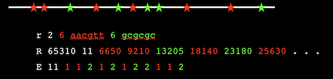
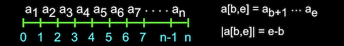
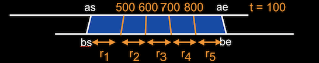
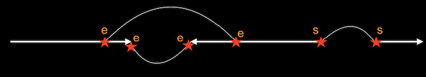

# VGP-tools: The VGP file formats for genome sequence assembly and related activities

### Authors:  Gene Myers, Richard Durbin, and the Vertebrate Genome Project Assembly Group
### Last Update: April 13, 2020

# Introduction

This document describes the VGP tools data schema developed for the
[Vertebrate Genomes Project](http://www.vertebrategenomes.org) to
represent source data, process intermediates, and the resulting
reconstructed genome assemblies for a large-scale DNA sequencing
project.  Along with these formats there is a growing set of 
documented [command line tools](https://github.com/VGP/vgp-tools/blob/master/VGP/docs/VGP-sequence-tools.md)
for carrying out file conversions and other operations on these objects. There is also
available an illustrative hypothetical [work flow](https://github.com/VGP/vgp-tools/blob/master/VGP/docs/VGP-assembly-workflow.md)
using these formats and tools (including some tools not yet written).

Apart from genome assembly, we believe that these formats and some of
the current tools will be potentially useful for other high
throughput DNA sequencing operations, and hope that the core elements
of the schema will become standardised to facilitate broad modular
data processing in large scale sequence data analysis.

The VGP tools data schema is a specific instance of a "One-Code" schema
which is a general framework for representing and manipulating data whose
primary advantages are a very simple ASCII format for each data object type
that is easy for both humans and programs to read and interpret,
with a corresponding compressed and indexed binary version so that production
sofwtare can be used for large scale data intensive applications.  Furthermore,
adding and modifying data types is simply a matter of editing the simple
specification of the schema [VGP_1_0.def](https://github.com/VGP/vgp-tools/blob/master/VGP_1_0.def).
We highly recommend that you read about the One-Code system
at the directory above (i.e. [here](https://github.com/VGP/vgp-tools/blob/master/README.md)).

# File Formats by Type

In the standard VGP sequence schema there are seven **primary file types**, one for each of *sequences*, *restriction maps*,
*alignments*, *joins*, *breaks*, and *lists*, that contain a collection of objects of the given type.  Each
of these can be specialized into **secondary file types** that ensure certain
semantic constraints on the objects (e.g. all reads are paired and have QVs), and/or introduce
additional information about each object (e.g. pulse widths for PacBio read sequences.)

The list below gives an overview of the currently supported VGP sequence file types where the secondary types
are listed indented below each primary.

- **.seq**   primary file type for sequence objects.
	- **.irp** for Illumina read pairs.
	- **.pbr** for PacBio long reads and relevant meta-data.
	- **.10x** for 10X Genomics read clouds with their extracted barcodes.
	- **.ctg** for contigs from an assembly.
	- **.kmr** for sets of kmers.

- **.rmp**   primary type for restriction map (RM) objects.
	- **.rmm** for RMs for individual molecules produced by e.g. Bionano.
	- **.rms** for RMs produced *in slico* from sequence.
	- **.rma** for RMs produced by assembly of molecule RMs.

- **.aln**   primary type for alignments between sequences and restriction maps.
	- **.sxs** for alignments between sequences (pronounced "success").
	- **.rxr** for alignments between restriction maps.
	- **.sxr** for alignments between sequences and restriction maps .
	- **.map** for alignments between sequences and a target superstring.
	
- **.hit**   primary type for incidence data of kmers in sequences and vice versa.
	- **.k2s** for lists per kmer of the sequences it hits.
	- **.s2k** for lists per sequence of the kmers that hit it.

- **.jns**   primary type for join information between (contig) sequences.

- **.brk**   primary type for break or mis-join information within (contig) sequences.

- **.lis**   a utility file type recording lists of objects of any of the other types.
	- **.lyo** lists of sequence alignments defining an assembly layout.
	- **.scf** lists of scaffolding links defining sets of linear scaffolds.

We specify here each file type in turn, aiming to describe all the
object types and their fields and how they are aimed to be used.  When reference header lines are required, we indicate so in the
description of the file type, together with what they signify.  We remind the reader that while
we aim to keep this README up to date, the formal versioned specification of each file type
is determined by the schema
**vgp-formats.\<majorversion>.\<minorversion>.fmt** against which the utility program **VGPstat** can validate individual files.

# 1. Sequence: .seq

This is the primary file type for encoding DNA sequences and auxiliary information such as
their quality values and whether or not the sequences are paired having come from the two
ends of an insert.  The line types that can occur in a .seq file and their syntax is as
follows:

```
  P                                indicates that the next two sequences are paired
  S <string>                       the sequence
  Q <string>                       QV scores in FASTQ encoding (ASCII 33+q) 
  g <int:ng> <string:group_name>   The next ng sequences are in this group
```
The only mandatory line is the S-line containing a sequence.  All the other lines are
optional.
The S strings are over the alphabet A, C, G, T.  IUPAC ambiguity codes are not supported.
Any unsupported code (including N) is turned into an arbitrary letter by VGP tools,
with quality set to 0 if qualities are present.  DNA strings may be upper or lower case.

If Q-lines occur, they should immediately follow the sequence they qualify, and the
length of the QV string is expected to be the same as the length of the sequence.
Each symbol of a Q string is a printable ASCII character as encoded in FASTQ.  So Q
strings are over the 94 printable ASCII characters [!-~] and correspond to the range 0 to 93.

If P-lines occur, then they are expected to be followed immediately by either a pair of S-lines,
or a pair of S and accompanying Q-lines.  The sequences of a P-line may not be split across a group
boundary.

If g-lines occur then they must form a partition over the set of sequences, that is,
every S-line must be contained in the scope of one and only one group. If pairs are present
then both the reads in a pair must be in the same group.  We typically use the g-lines both
for read groups in primary Illumina data and for read clouds in 10X Genomics data.  In the
latter case the group_name field is the barcode sequence defining the cloud.

The syntax of the data portion of a .seq-file can be summarized as follows:

```
  <seq_data>  = (<g-line> <seq_datum>^ng) + | <seq_datum> +
  <seq_datum> = <P-line> (<S-line> | <S-line> <Q-line>)^2 | <S-line> [<Q-line>]
```
We introduce the 4 secondary specializations of sequence files below.

## 1.1. Illumina read pairs, .irp

This subtype of .seq-files requires that all sequences and their associated QV's if present
are organized in read-pairs with P-lines.  If group lines are present then they should
correspond to sequencing lanes or the equivalent, as in SAM read groups.  For these files,
\#S = 2 #P and #Q = #S or #Q = 0.  See the documentation of **VGPseq** and **VGPpair** in Chapter 4 for an example
of how to produce a .irp file from a pair of possibly gzip'd .fasta or .fastq files.

## 1.2. 10X Genomics read clouds, .10x

This subtype is for processed 10x sequencing data. It requires paired reads as for a .irp, and
furthermore, that these pairs are organized into groups that correspond to read clouds, with
the barcode sequence as the name of the group, and the barcode and linker sequence removed from
every forward/first read (the first 23bp = 16bp of barcode and 7bp of linker).
See the documentation of **VGPcloud** in Chapter 4 for a tool that takes a .irp file of unsorted
Illumina read pairs and barcode-sorts, trims, and groups the pairs into a .10x-file.

## 1.3. PacBio long reads, .pbr

The .pbr subtype encodes the essential assembly information of a long read data set produced by
Pacific Biosciences.  P- and Q-lines do not occur and the S-lines are grouped according to the
SMRT cell that produced them, where the group name is the designation for
the given cell.  Each S-line must have accompanying well, pulse, and score information encoded in
an ensuing W-line with the following syntax:

```
  W <int:well> <int:1st_pulse> <int:last_pulse> <real:score>    read well, pulse range, and score
```
At a minimum, the W-line is necessary to identify when multiple subreads come from the same well.

There can optionally be two additional lines giving the channel SNR and pulse width
information needed by the consensus tool **Arrow**.  This information has been found by the
Pacbio software team to be the most informative indicators of read quality and could potentially
be used by a custom consensus or polishing algorithm.

```
  N <real:A> <real:C> <real:G> <real:T>   SNR in each base channel for read
  A <string>                              capped pulse widths
```
The N-line give the average SNR in the channels for each base for the given well the read came
from, and the A-line gives the capped pulse width for each base as the character 1, 2, 3 or 4.
Pulse widths larger than 4 are clipped to 4 as **Arrow** does not treat widths larger than 4
differently.  Basically short pulses are indications of potential error but any pulse over 4
units long is almost certainly a good call or a homopolymer run.  The A string must have the
same length as the S string for a given read .

The syntax of a sequence datum/object for .pbr-files is as follows:

```
  <seq_datum> = <S-line> <W-line> [ <N-line> <A-line> ]
```
See the documentation of **VGPpbr** in Chapter 4 for a tool that takes
that takes one or more Pacbio subreads.bam or .sam files as input
and extracts the information to make a .pbr file.

## 1.4. Contig files from assemblies, .ctg

This sequence subtype is the product of an assembler and contains only S-lines, one for each
(consensus) sequence for each contig.  Ideally there should be an associated **.sxs**
file, which gives the alignment of read to each of the contigs in this file, and possibly
a **.jns** file which gives intra-contig linkage information supporting the contig.
So in the header of a .ctg-file one expects to see the dependency headers:

```
  > <string:.sxs_file_name>
  > <string:.jns_file_name>
```

## 1.5. Kmer sets, .kmr

This sequence subtype contains lists of kmers that are usually expected to all be of the same length.  The S-line gives the kmer sequence.  The additional C-line type can be used to specify counts in a set of sequences, in which case there should be a reference line for the sequence file name.  If you want to record counts in more than one sequence-set, then give multiple sequence file names, and correspondingly multiple C-lines for each S-line. 

```
  < <string:.seq_file_name>

  C <int: count>
```

<br>

# 2. Restriction Map, .rmp

This file type encodes restriction maps, potentially with multiple enzymes with
distinct recognition sites. 

```
  r <int:nr> <int:s> <string:site>^s the next nr maps are over the s recognition sites listed
  R <int:len> <int:n> <int>^n        length of source seq. and list of site locations (in bp's)
  E <int:n> <int:[1,s]>^n            list of corresponding enzyme type per site (from 1..s)
```
The figure below gives an example of an encoding where there are two recognition sites, the first
colored red and the second colored green to provide emphasis.  



The file is always partitioned by group r-lines, although it would be typical for there to be
only 1.  Each R-line is followed by an E-line if and only if s > 1, i.e. there artse multiple
recognition sites for its r-group.  The list length of the E-line, if present, must
be the same as the R-line it is associated with.

The syntax of the data portion of a .rmp-file can be summarized as follows:

```
  <rm_data>  = (<r-line> <rm_daumt>^nr )+
  <rm_datum> = <R-line> (<E-line> if s > 1)
```
We introduce the 3 secondary specializations of restriction map files below.

## 2.1 BioNano raw data, .rmm

This subtype supports restriction maps of high molecular weight DNA strands from a Bionano
device adding two additional required lines for each R line:

```
  I <int:n> <real>^n               list of n intensities at each site in the map
  N <int:n> <real>^n               list of n signal to noise ratios at each site
```
These two lines follow the R-line they augment, and the length of their lists must be the same
as that of the R-line they are associated with.
See the documentation of **VGPbionano** in Chapter 4 for an example
of a tool that can produce a .rmm-file from Bionano's proprietary .bnx raw data files.

## 2.2. Restriction Map from Sequence, .rms

When the file is used to represent *in silico* maps of the recognitions sites from a sequences,
then there must be a reference header giving the source of the sequence, and for each R-line
an associated O-line referring back to the relevant sequence object.

```
  < <string:ref_sequence_filename> <int:ns>

  O <int>
```

## 2.3. BioNano assembled map, .rma

**To Be Designed**
This is a subtype with the potential to record additional information from map assembly.
BioNano Solve generates cmap files with many additional attributes per site, including a
standard deviation, coverage depth, occurrence depth (how many of input map molecules that
cover this site contain this site) and scores for the chance of this site being adjacent to
a chimeric join or a fragile site.  We could additional line types analogous to E to support
any of these that we feel is important to be recorded for downstream analysis.

<br>

# 3. Alignment, .aln

This is the primary file type for encoding local alignments or matches between segments of
both sequences and restriction maps.  Every alignment file must contain two references to
collections, called generically "A" and "B", of the object pairs being aligned.
The two references can be to the same file in the case of an "all against all" type comparison
typical in the first step of assembly.

```
  < <string:file_A> <int:na>        source of A objects = sequences or RMs
  < <string:file_B> <int:nb>        source of B objects = sequences or RMs
```
The series of alignments in the data segment are encoded with the following lines where
only the initial A-line is mandatory:

```
  A <int:a> <int:b>                       indexes of aligned sequences
  I <int:as> <int:ae> <int:alen>
    <int:bs> <int:be> <int:blen>          start and end in a and in b
  C <string>                              cigar string
  M <int>                                 number of matching aligned bases
  D <int>                                 number of differences = substitutions + indel bases
  Q <int>                                 alignment confidence in Phred units
```
An alignment is abstractly between intervals *a[as,ae]* and *b[bs,be]* of two list objects.
The two aligned objects are specified on an A-line where where ```a``` and ```b```
are indices into the A- and B-reference files.  An alignment description always begins with
an A-line.  The intervals of the two list objects being aligned are specified on a separate
I-line along with the overall length of the aligned objects.  It is very important to note that
we use a coordinate system that places a "tick" between each base/site beginning at 0.
For example, if the object is the string of bases or sites:
o<sub>1</sub>o<sub>2</sub>o<sub>3</sub> ... o<sub>n</sub>,
then coordinate x is *between* o<sub>x</sub> and o<sub>x+1</sub> and the interval [x,y]
spans the substring o<sub>x+1</sub>o<sub>x+2</sub> ... o<sub>y</sub> of length y-x.
If two objects align in opposite orientation to each other then the b-segment is complemented
which is encoded by having *bs > be* in which case *b[bs,be]* denotes
the Watson-Crick complement of *b[be,bs]*.



The details of an alignment can be specified with a SAM-style CIGAR string restricted to the
symbols I (insertion in A), D (deletion in A), = (match), and X (mismatch).
An I-line must be present if a C-line is used.  One may also optionally specify the number
of matches in an alignment with an M-line, the number of differences in an alignment with
a D-line, and a quality statistic on a Q-line.
The value in the Q field is the Phred-scaled confidence that the alignment is true, which is
defined as *-10log<sub>10</sub> p(alignment is false)*. This is the mapping quality for programs
that generate it. Otherwise programs that want to give score information should provide an
estimate. This can be followed by other method-specific scoring information, which because
it falls after the defined fields can be free form.

Suppose *i*, *d*, *m*, and *s* denote the number of insertions, deletions, matches, and
substitutions in an alignment.  Then *i+d+m+s* is the length of the CIGAR string, M = *m* and
D = *i+d+s*.  Given both the M- and D-lines, and observing the well-known relationship that
*(i+d) + 2(m+s) = (ae-as) + (be-bs) = S* where *S* is the sum of the lengths of the two aligned
subsequences, one can compute the number of substitutions *s = S-(D+M)*, and the simple
Levenshtein distance *i+d = 2(M+D)-S*.

A CIGAR string gives an item by item alignment of the relevant segments of two list objects,
but is very expensive in terms of encoding efficiency if the divergence between aligned
segments is high, as is true for long read data.
A trade-off strategy, that allows rapid reconstruction of an alignment at a modest cost
in space, is to break the alignment into sub-alignments that are relatively small, e.g. every
100 items in the A object, as described by Myers in a blog about
["trace points"](https://dazzlerblog.wordpress.com/2015/11/05/trace-points/).
To do so, we introduce a pair of U- and V-lines that give the partitioning trace points that
divide an alignment between the A and B objects into a series of sub-alignments.
Their syntax is as follows where we index the list of trace point values for use in the
explanation below:
<br>
<br>
<code>  U  \<int:n\> \<int:u<sub>1</sub>\> \<int:u<sub>2</sub>\> ... \<int:u<sub>n</sub>\>     list of absolute trace points in a</code>
<br>
<code>   V \<int:n\> \<int:v<sub>1</sub>\> \<int:v<sub>2</sub>\> ... \<int:v<sub>n</sub>\>     list of absolute trace points in b</code>
<br>
<br>
Let <code>u<sub>0</sub> = as</code> and <code>u<sub>n+1</sub> = ae</code>, and similarly
define <code>v<sub>0</sub></code> and <code>v<sub>n+1</sub></code>.
For valid U- and V-lines, <code>x<sub>i</sub> < x<sub>i+1</sub></code> for
all ```i``` in ```[0,n]```.
Together the lines specify that for all ```i```, <code>a[u<sub>i</sub>,u<sub>i+1</sub>]</code>
should be aligned with <code>b[v<sub>i</sub>,v<sub>i+1</sub>]</code>.  Normally aligning two
sequences of length *n* at divergence *&epsilon;* would take *O(&epsilon;n<sup>2</sup>)* time, but
if the alignment is divided at *n/&delta;* trace points with a spacing of *&delta;*
then reconstructing the alignment takes only *O(&epsilon;&delta;n)* time at the expense
of having to store the *n/&delta;* trace point divisions in U and V lines.


The UV-lines give one a general mechanism for splitting an alignment into a collection of panels
at a specified set of trace points.  Even more efficient encoding is possible by choosing the
A-object trace points to occur at every coordinate that is 0 (modulo t) for some spacing t.
For the B-partition one can more tersely encode the distance between the trace-points rather
than their absolute location.  This is encoded in specialized T- and W-lines with the syntax
below.

```
  T <int:t>                             globally set implicit trace points in a
  W <int:u+1> <int>^u+1                 list of trace point spacing in b
  X <int:u+1> <int>^u+1                 list of inter-trace point diffs
```
The T-line is unusual in that it stays in effect as a global attribute until reset by another
T-line (if at all).
Lastly, the X-line allows one to encode the number of differences in an optimal alignment between
each panel of the alignment partition.  The Dazzler
[Dazzler](https://dazzlerblog.wordpress.com).
assembly framework uses this value to assess the overall accuracy of panel-sized segments of reads.



All line types following the A-line are optional.  Typically an I-line will be present and only
one of C- or UV[TWX]-lines will be used downstream by any one application.
We introduce the 3 secondary specializations of alignment files below.

## 3.1. Sequence match file, .sxs

This subtype is always between two sequence collections in .seq files.  I-lines are mandatory
and for every alignment either a C-line or a U[T]-, V[W]-line pair is present to allow rapid
recomputation of the alignment's details.

## 3.2. Restriction map match file, .rxr

This subtype is always between two restriction map collections in .rmp files,
as in the .xmap files produced by the BioNano Hybrid Scaffold process.

## 3.3. Sequence vs. Restriction map match file, .sxr

While there is currently no software that we are aware of that does such comparisons directly,
producing first a .rms-file that give a putatitve restriction map from a sequence and then
comparing this with a restriction map, in effect does so.  A uutility VGP program is needed
that takes the .rms- and .rxr- files and produces a .sxr-flle that directly encodes the matches.

## 3.4. Sequence map file, .map

Another special case of a .aln file is when a sequence is derived from one or more previous
sequences, for example following an edit process during assembly polishing, or as the golden
path consensus of a multiple alignment of read subsequences.  In this case each sequence in
the target B-file (typically a .ctg-file) must be covered by the union of all its alignments
with reads in the A-file, so that every consensus base can be traced back.
In this case C-lines are necessary to specify the alignment exactly.

It is possible in principle to compose .map files so as to support tracing back coordinates
in a current set of sequences to those in previous sets, and a software tool to do so is
desirable.

<br>

# 4. Sequence to sequence hit, .hit

This file type is for recording match hits between query sequences in one file and target sequences in another file, optionally together with the locations of the hits.  The typical use of this file type is for kmer matches in sequences, but more generally we can think of it as recording global sequence matches and their start points. In this sense it is another type of alignment file, but .hit files are much lighter weight than .aln files because they do not give start and end coordinates in both sequences, alignments, etc. and only have one primary line type and object per query sequence, rather than one object per hit, which simplifies indexing and file reading.

```
< <string:a_seq_file>   <int:nseqs>            file sequences
< <string:b_seq_file>   <int:nseqs>            file sequences

H <int:seq_a> <int:nhit> <int:seq_b>^nhit      list of sequences b that have hits with sequence a
```

There are two subtypes of .hit files, one in which the queries are the a sequences, and there is an H-line for each kmer that gives the list of target sequences that contain kmer matches (with duplicates for multiple matches), and the other giving the inverse mapping in which there is an H-line for each target that lists the kmers that are found within it.

## 4.1 kmer to sequence hit file, .k2s

```
P <int:nhit> <int:pos_b>^nhit                  positions in each target seq_b of query seq_a
```

In this version the P-line gives the **positions** of the hits of query seq_a within each
of the targets seq_b listed on the preceding H-line.  Note that if seq_a is found twice in some seq_b then that seq_b must be listed twice in the H-line, with the positions of each hit given in the corresponding locations in the P line. 

## 4.2 sequence to kmer hit file, .s2k

```
O <int:nhit> <int:pos_a>^nhit                  offsets in query seq_a of each target seq_b
```

This version is used in the inverse situation when we want to list for each target the kmers that are found within it. The O-line then gives the **offsets** of the hits of each query seq_b within the target seq_a as listed on the preceding H-line.  As for .k2s, if a seq_b is found twice in seq_a then that seq_b must be listed twice in the H-line, with the offsets for each hit given in the corresponding locations in the O line. 

<br>

# 5. Contig join, .jns

For assemblies, we expect that our assembly process will create a **.seq** file of contigs,
and that various methods will be applied to use 10X Genomics, BioNano, HiC and/or other data
to propose joins between these contigs.
This file type encodes the possible joins.
We envision that there will be a program that can act on contig file together with lists of
putative joins to merge contigs where possible, and create scaffolds (see .scf file type below).

```
< <string:.ctg_file>   <int:nseqs>
< <string:.aln_file_1> <int:naln_1>
    . . .
< <string:.aln_file_k> <int:naln_k>

J <int:seq_a> <int:pos_a> [se] <int:seq_b> <int:pos_b> [se]   potential join link
Q <int:Phred_confidence>                                      score of confidence in the join
X <int:k> <int:n> <int:a>^n                    source k alignment objects evidencing the join
G <int:mean> <int:std. deviation>              mean & standard deviation of gap estimate
```
A J-line encodes a possible join between two contig sequences.
It asserts that there is evidence that the coordinate ```pos_a``` on sequence ```seq_a```
in the direction towards the end (```e```) or start (```s```)
is linked to the coordinate ```pos_b``` on sequence ```seq_b``` in the
given direction on ```seq_b```.
Frequently the coordinates will be either 0 or the length of the relevant sequence indicating
the beginning or end of the contig.
However, the specification of an internal position allows merging overlapping sequences.  Material beyond the coordinate is implicitly deleted.  If the user wishes to retain sequence then a Break (.brk) object should be used before the join (see next section).



An optional Q line encodes confidence in the assertion of the link. As in .sxs files, this is
encoded in Phred-scaled units *q* = -10log<sub>10</sub> p(link is false).  Further
score information from the specific method that proposed the join can be given after the
Phred score.  The line can qualify either a J- or a B-linee.

An optional X line points to the evidence from source k for the join assertion, in the form of
a list of alignments from the given source file which must be in the header.

An optional G line indicates the expected length of a join and its uncertainty as a standard deviation.
If the gap is negative then the contigs overlap by the specified number of bases.
For technologoies such as Hi-C or 10X read clouds that do not provide such estimates
on gap size, the G-line is simply not given.

## 6. Contig break, .brk

In counterpoint to joins, the same secondary information can also indicate intervals of a
contig where it was misassembled and a break should actually occur.  We consider both the .jns
and .brk files to encoding linkage infromation between and within contigs, and call them
collectively "link" files.  A .brk file consists of all the same lines as a .jns file except
that J-lines are replaced by B-lines, and G-lines do not occur.

```
B <int:seq> <int:start> <int:end>         potential break in contig between start and end
```

A B-line explicitly indicates a potential break.  The meaning is that there is evidence that
the given sequence should be broken somewhere between positions ```start``` and ```end```, as in practice scaffolding programs typically can only localise possible breaks to a wider
interval.  To be safe, a program that implements breaks listed in a .brk file should delete the intervening sequence.  Of course multiple lines of evidence might be used to refine the break endpoints before this is done.

## 7. List, .lis

This file type just keeps lists of indices into other VGP file types.  We use this to define
subsets of objects in existing VGP files, without needing to create an explicit listing of
all the objects, although this can be done if desired as in the case of a .map file for an
assembly.

```
< <string:list_file> <int:nx>
< <string:seed_file> <int:ns>
	
L <int:n> <int:[1,nx]>^n
S <int:[1,ns]>
N <string:name>
```
There must be a header line including the list object, and there can be an arbitrary number of
L-lines.  All other lines are optional.
Each L-line simply gives an ordered list of object references to the list file, where the
meaning of the order (or lack theref) depends on the secondary file type.

A list can be over alignment or join objects, and one may be doing so in order to implicitly
specify a listing of the underlying base objects (e.g. a list of joins between contigs
specifying a scaffold).
In this use case, one needs to allow for zero-length lists to encode an implicit list consisting
of a single base object (e.g. a contig), so we introduce an optional S-line that gives the
first base object or "seed" in any such implicit list.  If so, then one further needs to
include the file of base objects.

The optional N-line give an optional symbolic name to the list.  This is used primarily
in .scf-files (see below) to name the final scaffold objects output by an assembly pipeline.

## 7.1. Assembly layout file, .lyo

An assembly layout file consists of a collection of lists over sequence read alignments
between reads in the same .seq-file.  Each list encodes a path in the string graph of the
data set that specifies a contig.  The list is ordered along the path of overlapping alignments
from left to right and then follow containment alignments of additional shorter reads that fit
into the contig and provide additional data for consensus.

## 7.2. Scaffold file, .scf

A scaffold file consists of a collection of lists over a joins (.jns) file, each of which
gives a linear order of links defining a proposed assembly scaffold.
This structure supports generation of fasta with gaps filled with N's, and generation of the
Assembly Golden Path (agp) format.
